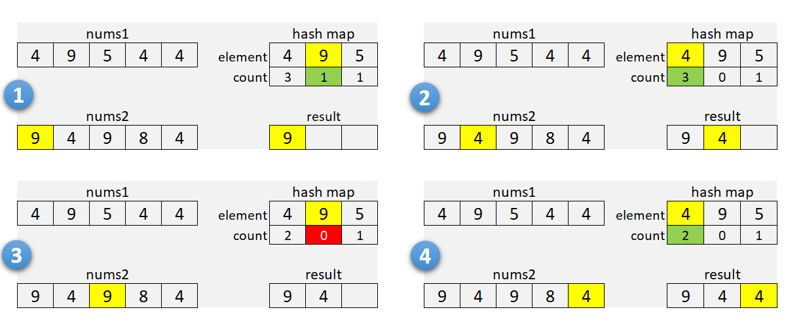
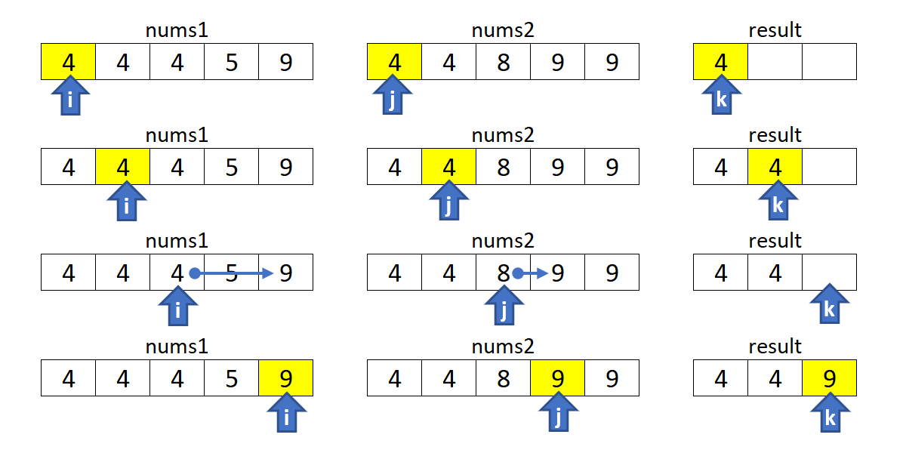

# 350. 两个数组的交集 II
> 给定两个数组，编写一个函数来计算它们的交集。
> 
> 示例 1:
> ```
> 输入: nums1 = [1,2,2,1], nums2 = [2,2]
> 输出: [2,2]
> ```
> 示例 2:
> ```
> 输入: nums1 = [4,9,5], nums2 = [9,4,9,8,4]
> 输出: [4,9]
> ```

### 哈希映射
#### 解法
- 对比两个列表，判断出长短列表。
- 遍历短列表，把短列表的数组和对应出现的次数存到哈希表中。第一次遍历短列表可以减少哈希的存储量。
- 遍历长列表，看当前数字是否在哈希表中，是的话就表示是交集，然后哈希表减 1。

下图是从 leetcode 官方题解拿的


```python
class Solution:
    def intersect(self, nums1: List[int], nums2: List[int]) -> List[int]: 
        arr, dic = list(), dict()
        longNums, shortNums = (nums1, nums2) if (len(nums1) >= len(nums2)) else (nums2, nums1)
        
        for n in shortNums:
            if n in dic:
                dic[n] += 1
            else:
                dic[n] =  1

        for n in longNums:
            if n in dic and dic[n] > 0:
                dic[n] -= 1
                arr.append(n)
        
        return arr
```
#### 复杂度分析
- 时间复杂度：O(m+n)。其中 n，m 分别代表了数组的大小。
- 空间复杂度：O(min(n,m))，我们对较小的数组进行哈希映射使用的空间.


### 排序
#### 解法
- 把两个列表排序
- 同时遍历两个列表，如果相等，那么就是交集，否则谁小谁的下标 + 1

下图是从 leetcode 官方题解拿的


```python
class Solution:
    def intersect(self, nums1: List[int], nums2: List[int]) -> List[int]: 
        nums1.sort()
        nums2.sort()
        i, j = 0, 0
        arr = list()
        while i < len(nums1) and j < len(nums2):
            if nums1[i] == nums2[j]:
                arr.append(nums1[i])
                i += 1
                j += 1
            elif nums1[i] < nums2[j]:
                i += 1
            else:
                j += 1
        return arr
```

#### 复杂度分析

- 时间复杂度：O(nlogn + mlogm)。其中 n，m 分别代表了数组的大小。我们对数组进行了排序然后进行了线性扫描。
- 空间复杂度：O(1)，我们忽略存储答案所使用的空间，因为它对算法本身并不重要。