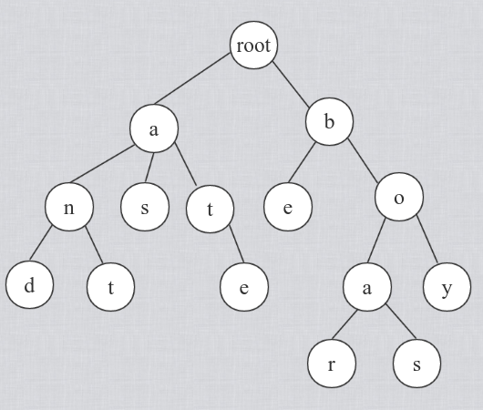
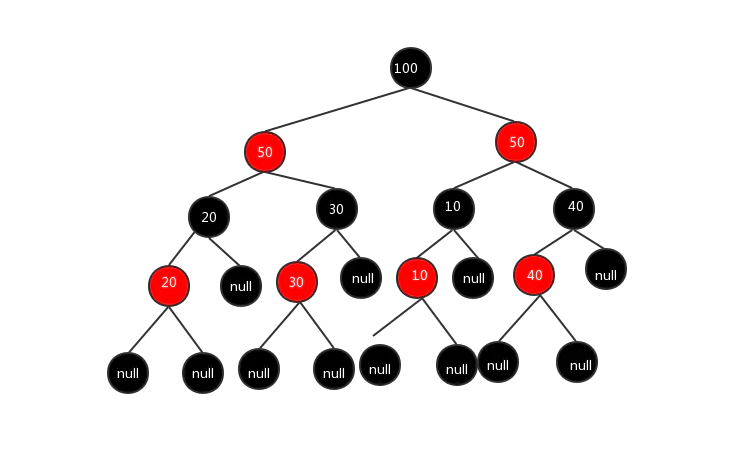

# 字典树
- 字典树本质是一颗多叉树，一般用于单词查找
- 树的节点就是字母，如果两个单词有共同的前缀，那么他们会共用树的前部分
- 多叉可以用字典表示，也可以用数组表示
- 需要记录叶子节点是不是包含结束标志，如果不是，那么只是个前缀，不是单词
- 字典树的应用比较局限，也是一个比较独立的数据结构。



```python
class Trie:

    def __init__(self):
        self.trie = dict()

    def insert(self, word: str) -> None:
        tree = self.trie
        for w in word:
            tree = tree.setdefault(w, dict())
        tree['#'] = '#'

    def search(self, word: str) -> bool:
        tree = self.trie
        for w in word:
            if w not in tree:
                return False
            tree = tree[w]
        return '#' in tree

    def startsWith(self, prefix: str) -> bool:
        tree = self.trie
        for w in prefix:
            if w not in tree:
                return False
            tree = tree[w]
        return True
```

# 并查集
- 并查集也是一个很独立的数据结构，主要用于分群

```python
def init(p): 
    # for i = 0 .. n: p[i] = i; 
    p = [i for i in range(n)] 
 
def union(self, p, i, j): 
    p1 = self.parent(p, i) 
    p2 = self.parent(p, j) 
    p[p1] = p2 
 
def parent(self, p, i): 
    root = i
    while p[root] != root: 
        root = p[root] 
    while p[i] != i: # 路径压缩
        x = i; i = p[i]; p[x] = root 
    return root
```

# 高级搜索
## 剪枝
- 提前把没有用的分支减掉

## 双向 BFS
- 从起点和终点同时扩展，最终相遇的时候，路径之和就是总路径

## 启发式搜索
- 又称 A* 搜索
- 优先搜索优先级比较高的，把 BFS 的队列换成优先队列
- 如何定义优先级是一个难点

# AVL 树
- 平衡二叉树
- 每棵树的高度差不超过 1
- 每次插入、删除，都会进行树的调整
    - 左旋
    - 右旋
    - 左右旋
    - 右左旋
- 插入删除性能较低、查询性能较高

# 红黑树
- 红黑树有几个特性
    1. 每个节点只能是红色或者黑色
    2. 根节点必须是黑色
    3. 红色的节点,它的叶节点只能是黑色
    4. 从任一节点到其每个叶子的所有路径都包含相同数目的黑色节点
    5. 从一个节点到该节点的子孙节点的所有路径上包含相同数目的黑节点
- 最大高度差 2 倍
- 插入和查询性能做了一定的平衡
    - 插入删除性能比 AVL 树高，因为旋转频率比较低
    - 查询性能比 AVL 树低，因为高度差比较高

