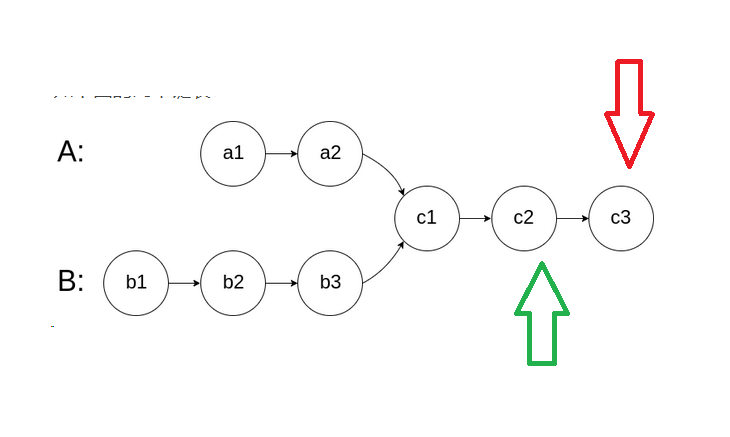

# 160. 相交链表
编写一个程序，找到两个单链表相交的起始节点。

## 解法一：哈希表
### 解法
- 分别遍历 A 和 B，遍历的时候存两个 set 里面
- 判断 A 是否在 setB, B 是否在 setA

```python
class Solution:
    def getIntersectionNode(self, headA: ListNode, headB: ListNode) -> ListNode:
        setA = set()
        setB = set()
        while headA or headB:
            if headA: setA.add(headA)
            if headB: setB.add(headB)
            if headA and headA in setB: return headA
            if headB and headB in setA: return headB
            if headA: headA = headA.next
            if headB: headB = headB.next
```

### 复杂度
- 时间复杂度：$O(max(m, n))$，m和n表示两个链表的长度
- 空间复杂度：$O(m + n)$

## 解法二：双指针
### 解法
- 两个指针，a 和 b，分别指向 headA 和 headB
- 遍历到末端，也就是 a == null 的时候，跑到 headB。b 同理。
- 这样他们在第二遍交叉点一定相遇，因为他们走过了路程一样。

```python
class Solution:
    def getIntersectionNode(self, headA: ListNode, headB: ListNode) -> ListNode:
        a = headA
        b = headB
        while a != b:
            a = a.next if a else headB
            b = b.next if b else headA
        return a
```

### 复杂度
- 时间复杂度：$O(m + n)$
- 空间复杂度：$O(1)$